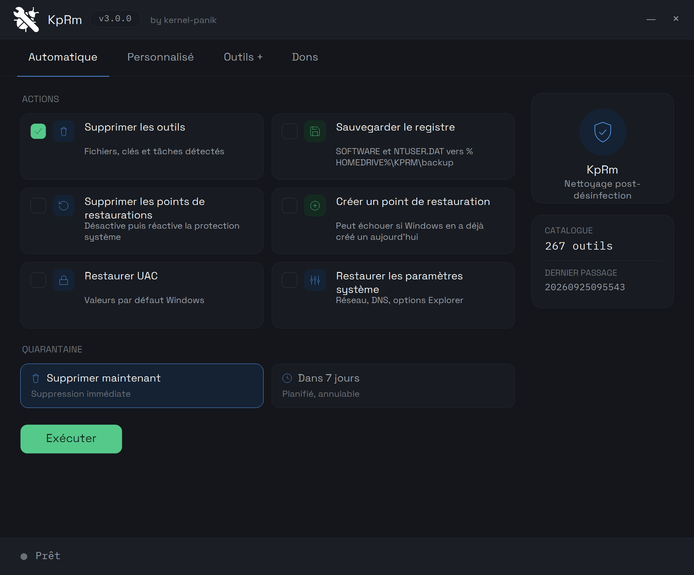
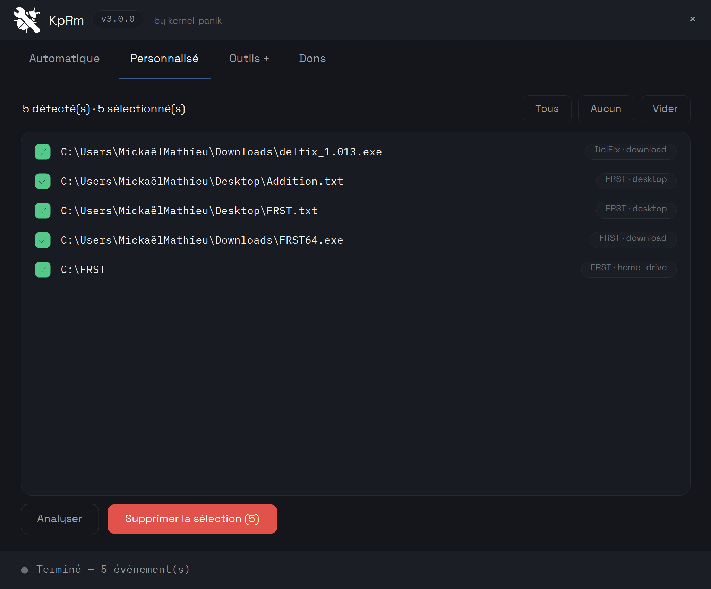

# KpRm


[Download the latest release](../../releases)

This is a Rust rewrite of the original AutoIt3 KpRm by
[kernel-panik](https://kernel-panik.me/) — see
[`../docs/RUST-REWRITE-SPEC.md`](../docs/RUST-REWRITE-SPEC.md) for the
full design rationale.

### KpRm is a tool to use to finalize a disinfection, it removes the following software:

- AdliceDiag (Tigzy)
- AdminRun (g3n-h@ckm@n)
- Ads (g3n-h@ckm@n)
- AdsFix (g3n-h@ckm@n)
- AdwCleaner (Malwarebytes)
- AHK_NavScan (Batch_Man)
- Alcatraz Decryptor
- AlphaDecrypter (Michael Gillespie)
- AswMBR (Avast!Software)
- AuroraDecrypter (Michael Gillespie)
- Autoruns
- AutorunsVTChecker (regist)
- Avast Decryptor Akira
- Avast Decryptor AtomSilo / LockFile
- Avast Decryptor Babuk
- Avast Decryptor BadBlock
- Avast Decryptor Bart
- Avast Decryptor BigBobRoss
- Avast Decryptor Cryptomix (Avast!Software)
- Avast Decryptor LambdaLocker
- Avast Decryptor Prometheus
- Avast Decryptor Rhysida
- Avast Decryptor Yanluowang
- AVCertClean (fr33tux)
- Avenger (swandog46)
- Avira Registry Cleaner (Avira)
- Bitdefender Annabelle Decryptor
- Bitdefender DarkSide Decryptor
- Bitdefender FONIX Decryptor
- Bitdefender GandCrab Decryptor
- Bitdefender LockerGoga Decryptor
- Bitdefender MegaCortex Decryptor
- Bitdefender Ouroboros Decryptor
- Bitdefender REvil Decryptor
- BitKangarooDecrypter (Michael Gillespie)
- BitStakDecrypter (Michael Gillespie)
- Black Basta Decryptor
- BlitzBlank (Emsisoft)
- BTCWareDecrypter (Michael Gillespie)
- Catchme (Gmer)
- Check Browsers LNK (Alex Dragokas & regist)
- CKScanner (askey127)
- Clean_DNS (g3n-h@ckm@n)
- ClearLNK (Alex Dragokas)
- CMD_Command (g3n-h@ckm@n)
- CoinVaultDecryptor (Kaspersky Labs)
- Combofix (sUBs)
- Crypt38Decrypter (Michael Gillespie)
- CryptoSearch (Michael Gillespie)
- CrystalDiskInfo (portable)
- CWShredder
- D7II
- DCryDecrypter (Michael Gillespie)
- DDS (sUBs)
- Decrypt CryptON (Emsisoft)
- Defogger (jpshortstuff)
- DelFix
- DoesNotBelong (Furtivex)
- Dr.Web Cureit
- Dr.Web LiveDisk
- Easy Restore Point (kernel-panik)
- Emisoft Emergency Kit (Emsisoft)
- Emsisoft Decryptor Amnesia
- Emsisoft Decryptor Apocalypse
- Emsisoft Decryptor BadBlock
- Emsisoft Decryptor Bart
- Emsisoft Decryptor Globe / GlobeImposter
- Emsisoft Decryptor NMoreira
- Emsisoft Decryptor Philadelphia
- Emsisoft Decryptor Phobos
- Emsisoft Decryptor Stampado
- Emsisoft Decryptor STOP Djvu
- Emsisoft Decryptor SZFLocker
- ESET AES-NI Decryptor (Eset)
- ESET Bedep Cleaner (Eset)
- ESET Bubnix Cleaner (Eset)
- ESET CodplatAA Cleaner (Eset)
- ESET Conficker Cleaner (Eset)
- ESET Crypt888 Decryptor (Eset)
- ESET Crysis Decryptor (Eset)
- ESET Daonol Cleaner (Eset)
- ESET Dorkbot Cleaner (Eset)
- ESET ELEX Cleaner (Eset)
- ESET Eternal Blue Checker (Eset)
- ESET Filecoder Cleaner (Eset)
- ESET Filecoder.AA Cleaner (Eset)
- ESET Filecoder.AE Cleaner (Eset)
- ESET Filecoder.AR Cleaner (Eset)
- ESET Filecoder.NAC Cleaner (Eset)
- ESET Filecoder.R Cleaner (Eset)
- ESET GandCrab Decryptor (Eset)
- ESET Goblin Cleaner (Eset)
- ESET JS/Bondat Fixer (Eset)
- ESET Log Collector (Eset)
- ESET Mabezat Decryptor (Eset)
- ESET Mebroot Cleaner (Eset)
- ESET Medre Cleaner (Eset)
- ESET Necurs.A Cleaner (Eset)
- ESET Olmarik Cleaner (Eset)
- ESET Online Scanner (Eset)
- ESET Poweliks Cleaner (Eset)
- ESET Quervar.C Cleaner (Eset)
- ESET Retacino Cleaner (Eset)
- ESET Retefe Detector (Eset)
- ESET Rogue Applications Remover (Eset)
- ESET Rovnix.A Cleaner (Eset)
- ESET Simda Cleaner (Eset)
- ESET Sirefef Cleaner (Eset)
- ESET Spy.Tuscas Cleaner (Eset)
- ESET Spy.Zbot.ZR Cleaner (Eset)
- ESET SpyEye Cleaner (Eset)
- ESET Superfish Cleaner (Eset)
- ESET SysInspector (Eset)
- ESET SysRescue (Eset)
- ESET TeslaCrypt Decryptor (Eset)
- ESET Trustezeb.A Decoder (Eset)
- ESET VB.NAX Cleaner (Eset)
- ESET VB.OGJ Cleaner (Eset)
- ESET Virlock Cleaner (Eset)
- ESET Zimuse Cleaner (Eset)
- Farbar Mini Toolz
- FilesLockerDecrypter (Michael Gillespie)
- FixExec (BleepingComputer)
- FixPurge (McVivien2)
- FixWin
- FRST (Farbar)
- FSS (Farbar)
- g3n-h@ckm@n tools
- GetSystemInfo (Kaspersky Labs)
- GhostCryptDecrypter (Michael Gillespie)
- GibonDecrypter (Michael Gillespie)
- GMER
- GooredFix (jpshortstuff)
- Grantperms (Farbar)
- GridinSoft Anti-Malware
- HiddenTear Bruteforcer (Michael Gillespie)
- HiddenTearDecrypter (Michael Gillespie)
- HijackThis
- HitmanPro
- Hosts-perm (BleepingComputer)
- HostsXpert (funkytoad)
- InsaneCryptDecrypter (Michael Gillespie)
- JavaRa (Fred de Vries et Paul McLain)
- JigSawDecrypter (Michael Gillespie)
- Junkware Removal Tool (Malwarebytes corporation)
- Kaspersky CryptXXX Decryptor
- Kaspersky Dharma Decryptor
- Kaspersky FortuneCrypt Decryptor
- Kaspersky MarsJoke Decryptor
- Kaspersky Rescue Disk (Kaspersky Labs)
- Kaspersky Scatter Decryptor
- Kaspersky Virus Removal Tool (Kaspersky Labs)
- Kaspersky Yatron Decryptor
- KPLive (kernel-panik)
- KpRm Rapport diagnostic
- KPTemp (kernel-panik)
- ListCWall (BleepingComputer)
- ListParts (Farbar)
- LockBit 3.0 Decryptor
- LogonFix (Xplode)
- Look_my_hardware (g3n-h@ckm@n)
- Malwarebytes (log) (Malwarebytes corporation)
- Malwarebytes Anti-Rootkit (Malwarebytes corporation)
- Malwarebytes Support Tool (Malwarebytes corporation)
- Maze / Sekhmet / Egregor Decryptor
- Mbr.exe (Gmer)
- MBRCheck (a_d_13)
- MbrScan (Eric_71)
- McAfee GetSusp (McAfee)
- McAfee Pinkslipbot (McAfee)
- McAfee RootkitRemover (McAfee)
- McAfee Stinger (McAfee)
- McAfee Tesladecrypt (McAfee)
- MemControl (g3n-h@ckm@n)
- Microsoft Safety Scanner (Microsoft)
- MiniregTool (Farbar)
- Minitoolbox (Farbar)
- MirCopDecrypter
- MKV (El Desaparecido & C_XX)
- Mole02Decryptor (M AV)
- Nemucod / NemucodAES Decryptor
- NetAdapter Repair All In One (Conner Bernhard)
- Norton Power Eraser
- OldTimer Tools
- OneClick2RP (Laddy)
- OTA (Old_Timer)
- OTC (Old_Timer)
- OTH (Old_Timer)
- OTL (Old_Timer)
- OTM (Old_Timer)
- OTS (Old_Timer)
- Paradise Decryptor
- PCHunter (epoolsoft)
- PowerLockyDecrypter (Michael Gillespie)
- Pre_Scan (g3n-h@ckm@n)
- Process Analyzer (g3n-h@ckm@n)
- Process Hacker
- ProcessClose (g3n-h@ckm@n)
- PyLocky Decryptor
- QuickDiag (g3n-h@ckm@n)
- Rakhni Decryptor (Kaspersky Lab)
- Rannoh Decryptor (Kaspersky Lab)
- RansomNoteCleaner (Michael Gillespie)
- RAV (Evosla)
- Regshot
- RegtoolExport (Xplode)
- Remediate VBS Worm (bartblaze)
- Report_Antivir (Laddy)
- Report_CHKDSK (Laddy)
- ResetBrowser (comment-supprimer.com)
- ResetNavigator (SoftwareQuality)
- Rkill (Grinler)
- RogueKiller (Tigzy)
- RogueKillerCMD (Tigzy)
- Rooter (Team IDN)
- RootkitRevealer (Microsoft)
- RstAssociations (Xplode)
- RstHosts (Xplode)
- ScanRapide (Lydem)
- SEAF (C_XX)
- SecurityCheck (screen317)
- ServicesRepair (Eset)
- SFT (Pierre13)
- ShadeDecryptor (Kaspersky Labs)
- Shortcut Cleaner (BleepingComputer)
- SMBCheck (Webroot)
- SmitFraudFix
- Sophos Scan and Clean
- Spybot Search & Destroy
- StrikedDecrypter (Michael Gillespie)
- StupidDecrypter (Michael Gillespie)
- SUPERAntiSpyware
- Symantec Kovter Removal Tool (Symantec)
- Symantec Pasobir Removal Tool (Symantec)
- Symantec Ramnit Removal Tool (Symantec)
- Symantec Tempedreve Removal Tool (Symantec)
- System Information Tool (Tweaking.com)
- System Informer
- Systemlook (jpshortstuff)
- TDSSKiller (Kaspersky Labs)
- TFC (Old_Timer)
- ToolsDiag (Amesam)
- Trend Micro HouseCall
- Trend Micro Ransomware Decryptor
- UAC Manager (Xplode)
- UAC-Level (Amesam)
- UnHackMe
- UnHide (BleepingComputer)
- Unlock92Decrypter (Michael Gillespie)
- UnZacMe (g3n-h@ckm@n)
- USB File Resc (Streuner Corporation)
- USBFix (El desaparecido & C_XX)
- Webroot DE-BUG (Webroot)
- WildfireDecryptor (Kaspersky Labs)
- WinCHK (Xplode)
- Windows Repair All In One (portable) (Tweaking.com)
- WinsockAnalyzer (Xplode)
- WinUpdatefix (Xplode)
- XoristDecryptor (Kaspersky Labs)
- Zemana AntiMalware
- ZHP Tools
- ZHPCleaner (Nicolas Coolman)
- ZHPDiag (Nicolas Coolman)
- ZHPFix (Nicolas Coolman)
- ZHPLite (Nicolas Coolman)
- ZHPSuite (Nicolas Coolman)
- Zoek (Smeenk)

Each entry is one `tools.d/<name>.toml` file describing what to look
for and what to do about each match — see
[`../docs/RUST-REWRITE-SPEC.md`](../docs/RUST-REWRITE-SPEC.md) Annex B
for the schema if you're adding or editing one.

The search for executables downloaded by the user is only performed in
the Desktop and the Downloads folder. It is possible to choose whether
to delete quarantined items immediately or in 7 days. A "Custom scan"
tab lets you detect tools and choose which files/keys get deleted.





### - Save the registry

Backs up `HKLM\SOFTWARE` and the current user's `NTUSER.DAT` before
making changes, with the option to restore a previous backup at next
boot.

### - Delete recovery points

### - Create a restore point

### - Restore system settings

- Reset DNS cache
- Reset the WinSock catalog
- Hide hidden files
- Hide protected files
- Show known file extensions

### - Restore the UAC

- ConsentPromptBehaviorAdmin (5)
- ConsentPromptBehaviorUser (3)
- EnableInstallerDetection (0)
- EnableLUA (1)
- EnableSecureUIAPaths (1)
- EnableUIADesktopToggle (0)
- EnableVirtualization (1)
- FilterAdministratorToken (0)
- PromptOnSecureDesktop (1)
- ValidateAdminCodeSignatures (0)

### - Extra tools

Post-disinfection maintenance, new in this rewrite:

- Flush DNS, clean temp folders
- Reset firewall, run SFC, run DISM
- Reset Winsock, reset the hosts file, remove the system proxy
- Reset browser group policies, restore default file associations
- Generate a full system diagnostic report (processes, services,
  drivers, startup entries, scheduled tasks — each with MD5, signature
  and an ACL check — installed software, browser extensions, security
  tools, event logs, network, and more)
- Restore a registry backup over the live hives at next boot

### - Donate

KpRm is free and will stay that way — if it helped you out, a donation
is welcome but never required.

- PayPal: https://www.paypal.me/kernelpan1k
- Bitcoin (BTC): `bc1qeuy23256g05v80ggcy6ezwrlhxttrhm827hf2u`
- Ethereum (ETH): `0x02AF1772AADaE8abf1d522aF5E87115E1Ed0dea5`
- Litecoin (LTC): `Lh3p9yoDzJrYKHDm3TaW55B49q2uMVZaj5`
- Monero (XMR): `BUsMZ3KoHcPvUAKCuFL8dsgUQAuWBJbaRxda6sQ8ND53`

The same addresses are in the app's own Donate tab, each with a QR
code and a one-click copy button.

## Command line

Give `kprm.exe` a subcommand to run it headlessly instead of opening a
window:

```
kprm.exe <SUBCOMMAND> [OPTIONS]
```

| Subcommand | Description |
|---|---|
| `catalog stats` | Print the number of tools and actions in the embedded catalog. |
| `catalog list` | Print every tool name in the catalog, one per line. |
| `catalog validate` | Validate the embedded catalog; exits non-zero and lists errors if anything is invalid. |
| `translate <locale> <key>` | Print one translated string from the embedded Fluent translations. |
| `locales` | List the locale codes this build embeds translations for. |
| `scan [--quarantine <keep\|now\|sevendays>]` | Read-only scan of the whole catalog against this machine. Deletes nothing. |
| `remove [--quarantine <keep\|now\|sevendays>] --confirm` | Runs the full removal engine for real. Requires `--confirm`; refuses to run if the process isn't elevated. |

`--quarantine` (on `scan` and `remove`) controls what happens to items
the catalog flags as quarantine-eligible:

- `keep` (default) — leave them where they are
- `now` — delete them immediately
- `sevendays` — leave them for now, but schedule their real deletion 7
  days later via a one-time Windows Scheduled Task

`kprm.exe --quarantine-cleanup <file>` is an internal entry point that
7-day scheduled task uses to rerun the deletion headlessly — not meant
to be invoked directly.

#### Examples

```bash
# See what's on this machine without touching anything
kprm.exe scan

# Remove everything found, keeping quarantine-eligible items in place
kprm.exe remove --confirm

# Remove everything found, deleting quarantine-eligible items after 7 days
kprm.exe remove --quarantine sevendays --confirm

# Inspect the embedded catalog
kprm.exe catalog stats
kprm.exe catalog validate
```

## License

GPL-3.0-or-later, same as the original AutoIt3 project.

## Contributors

<a href="https://github.com/kernelPan1k"></a>
<a href="https://github.com/cocochepeau"></a>
<a href="https://genhackmantools.wordpress.com/"></a>
<a href="https://github.com/ave9858"></a>
