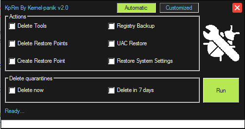

# KpRm

[Download KpRm](https://toolslib.net/downloads/viewdownload/951-kprm/)

### KpRm is a tool to use to finalize a disinfection, it removes the following software:

 - AdliceDiag (Tigzy)
 - AdminRun (g3n-h@ckm@n)
 - AdsFix (g3n-h@ckm@n)
 - Ads (g3n-h@ckm@n)
 - AdwCleaner (Malwarebytes)
 - AHK_NavScan (Batch_Man)
 - AlphaDecrypter (Michael Gillespie)
 - AswMBR (Avast!Software)
 - AuroraDecrypter (Michael Gillespie)
 - Autoruns (sysinternals)
 - AutorunsVTChecker (regist)
 - Avast Decryptor Cryptomix (Avast!Software)
 - AVCertClean (fr33tux)
 - Avenger (swandog46)
 - Avira Registry Cleaner (Avira)
 - BitKangarooDecrypter (Michael Gillespie)
 - BitStakDecrypter (Michael Gillespie)
 - BlitzBlank (Emsisoft)
 - BTCWareDecrypter (Michael Gillespie)
 - Catchme (Gmer)
 - Check Browsers LNK (Alex Dragokas & regist)
 - CKScanner (askey127)
 - Clean_DNS (g3n-h@ckm@n)
 - ClearLNK (Alex Dragokas)
 - CMD_Command (g3n-h@ckm@n)
 - CoinVaultDecryptor (Kaspersky Labs)
 - Combofix (sUBs)
 - Crypt38Decrypter (Michael Gillespie)
 - CryptON Ransomware Decryptor (Emsisoft)
 - CryptoSearch (Michael Gillespie)
 - CrystalDiskInfo (portable)
 - DCryDecrypter (Michael Gillespie)
 - DDS (sUBs)
 - Defogger (jpshortstuff)
 - Dr Web LiveCD
 - EasyRestorePoint (kernel-panik)
 - Emsisoft Emergency Kit (Emsisoft)
 - ESET AES-NI Decryptor (Eset)
 - ESET Bedep Cleaner (Eset)
 - ESET Bubnix Cleaner (Eset)
 - ESET CodplatAA Cleaner (Eset)
 - ESET Conficker Cleaner (Eset)
 - ESET Crypt888 Decryptor (Eset)
 - ESET Crysis Decryptor (Eset)
 - ESET Daonol Cleaner (Eset)
 - ESET Dorkbot Cleaner (Eset)
 - ESET ELEX Cleaner (Eset)
 - ESET Eternal Blue Checker (Eset)
 - ESET Filecoder.AA Cleaner (Eset)
 - ESET Filecoder.AE Cleaner (Eset)
 - ESET Filecoder.AR Cleaner (Eset)
 - ESET Filecoder Cleaner (Eset)
 - ESET Filecoder.NAC Cleaner (Eset)
 - ESET Filecoder.R Cleaner (Eset)
 - ESET GandCrab Decoder (Eset)
 - ESET Goblin Cleaner (Eset)
 - ESET JS/Bondat Fixer (Eset)
 - ESET Log Collector (Eset)
 - ESET Mabezat Decryptor (Eset)
 - ESET Mebroot Cleaner (Eset)
 - ESET Medre Cleaner (Eset)
 - ESET Necurs.A Cleaner (Eset)
 - ESET Olmarik Cleaner (Eset)
 - ESET Online Scanner (Eset)
 - ESET Poweliks Cleaner (Eset)
 - ESET Quervar.C Cleaner (Eset)
 - ESET Retacino Cleaner (Eset)
 - ESET Retefe Detector (Eset)
 - ESET Rogue Applications Remover (Eset)
 - ESET Rovnix.A Cleaner (Eset)
 - ESET Simda Cleaner (Eset)
 - ESET Sirefef Cleaner (Eset)
 - ESET SpyEye Cleaner (Eset)
 - ESET Spy.Tuscas Cleaner (Eset)
 - ESET Spy.Zbot.ZR Cleaner (Eset)
 - ESET Superfish Cleaner (Eset)
 - ESET SysRescue (Eset)
 - ESET TeslaCrypt Decryptor (Eset)
 - ESET Trustezeb.A Decoder (Eset)
 - ESET VB.NAX Cleaner (Eset)
 - ESET VB.OGJ Cleaner (Eset)
 - ESET Virlock Cleaner (Eset)
 - ESET Zimuse Cleaner (Eset)
 - FilesLockerDecrypter (Michael Gillespie)
 - FixExec (BleepingComputer)
 - FixPurge (McVivien2)
 - FRST (Farbar)
 - FSS (Farbar)
 - GetSystemInfo (Kaspersky Labs)
 - GhostCryptDecrypter (Michael Gillespie)
 - GIBON Ransomware Decryptor (Michael Gillespie)
 - GooredFix (jpshortstuff)
 - GrantPerms (Farbar)
 - HiddenTear Bruteforcer (Michael Gillespie)
 - HiddenTear Decrypter (Michael Gillespie)
 - Hosts-perm.bat (BleepingComputer)
 - HostsXpert (funkytoad)
 - InsaneCryptDecrypter (Michael Gillespie)
 - JavaRa (Fred de Vries et Paul McLain)
 - Jigsaw Decrypter (Michael Gillespie)
 - Junkware Removal Tool (Malwarebytes corporation)
 - Kaspersky Live Rescue (Kaspersky Labs)
 - Kaspersky Virus Removal Tool (Kaspersky Labs)
 - KPLive (kernel-panik)
 - KpTemp (kernel-panik)
 - ListCWall (BleepingComputer)
 - ListParts (Farbar)
 - LogOnFix (Xplode)
 - Look_my_hardware (g3n-h@ckm@n)
 - Malwarebytes (log) (Malwarebytes corporation)
 - MBAR (Malwarebytes corporation)
 - MBRCheck (a_d_13)
 - mbr.exe (Gmer)
 - MbrScan (Eric_71)
 - McAfee GetSusp (McAfee)
 - McAfee Pinkslipbot (McAfee)
 - McAfee RootkitRemover (McAfee)
 - McAfee Stinger (McAfee)
 - McAfee Tesladecrypt (McAfee)
 - MicroCop Decryptor (Michael Gillespie)
 - Miniregtool (Farbar)
 - Minitoolbox (Farbar)
 - MKV (El Desaparecido & C_XX)
 - Mole02Decryptor (M AV)
 - NetAdapter Repair All In One (Conner Bernhard)
 - OneClick2RP (Laddy)
 - OTA (Old_Timer)
 - OTC (Old_Timer)
 - OTH (Old_Timer)
 - OTL (Old_Timer)
 - OTM (Old_Timer)
 - OTS (Old_Timer)
 - PCHunter (epoolsoft)
 - PowerLockyDecrypter (Michael Gillespie)
 - Pre_Scan (g3n-h@ckm@n)
 - Process Analyzer (g3n-h@ckm@n)
 - ProcessClose (g3n-h@ckm@n)
 - QuickDiag (g3n-h@ckm@n)
 - RakhniDecryptor (Kaspersky Lab)
 - Rannoh Decryptor (Kaspersky Lab)
 - RansomNoteCleaner (Michael Gillespie)
 - RAV (Evosla)
 - RegtoolExport (Xplode)
 - Remediate VBS Worm (bartblaze)
 - Report_Antivir (Laddy)
 - Report_CHKDSK (Laddy)
 - ResetBrowser (comment-supprimer.com)
 - ResetNavigator (SoftwareQuality)
 - Rkill (Grinler)
 - RogueKiller (Tigzy)
 - RogueKiller CMD (Tigzy)
 - Rooter (Team IDN)
 - RootkitRevealer (Microsoft)
 - RstAssociations (Xplode) (scr) (exe)
 - RstHosts (Xplode)
 - ScanRapide (Lydem)
 - Seaf (C_XX)
 - SecurityCheck (screen317)
 - ServicesRepair (Eset)
 - SFTGC (Pierre13)
 - ShadeDecryptor (Kaspersky Labs)
 - Shortcut Cleaner (BleepingComputer)
 - SMBCheck (Webroot)
 - StrikedDecrypter (Michael Gillespie)
 - StupidDecryptor (Michael Gillespie)
 - Symantec Kovter Removal Tool (Symantec)
 - Symantec Pasobir Removal Tool (Symantec)
 - Symantec Ramnit Removal Tool (Symantec)
 - Symantec Tempedreve Removal Tool (Symantec)
 - System Information Tool (Tweaking.com)
 - SystemLook (jpshortstuff)
 - TDSSkiller (Kaspersky Labs)
 - TFC (Old_Timer)
 - ToolsDiag (Amesam)
 - UAC-LEVEL (Amesam)
 - UAC Manager (Xplode)
 - UnHide (BleepingComputer)
 - Unlock92Decrypter (Michael Gillespie)
 - UnZacMe (g3n-h@ckm@n)
 - Usb File Resc (Streuner Corporation)
 - UsbFix (El desaparecido & C_XX)
 - Webroot DE-BUG (Webroot)
 - WildfireDecryptor (Kaspersky Labs)
 - WinChk (Xplode)
 - Windows Repair All In One (portable) (Tweaking.com)
 - WinsockAnalyzer (Xplode)
 - WinUpdatefix (Xplode)
 - XoristDecryptor (Kaspersky Labs)
 - ZHPCleaner (Nicolas Coolman)
 - ZHPDiag (Nicolas Coolman)
 - ZHPFix (Nicolas Coolman)
 - ZHPLite (Nicolas Coolman)
 - ZHPSuite (Nicolas Coolman)
 - Zoek (Smeenk)

The search for executables downloaded by the user is only performed in the Desktop and the download folder.
To respect Nicolas Coolman's choice, the quarantine of ZHP tools located under AppData\ZHP is no longer deleted,
however a line in the report indicates its presence. It is now possible since version 2.0 to choose whether to delete quarantines directly, delete them in 7 days or not delete them at all.
A new feature allows you to detect tools and choose which files/keys will be deleted.

### - Save the registry

To restore hives easily, it is possible to use KPLive: https://github.com/KernelPan1k/KpLive

### - Delete recovery points

### - Create a restore point

### - Restore system settings

- Reset DNS cache
- Reset the WinSock catalog
- Hide hidden files
- Hide protected files
- Show known file extensions

### - Restore the UAC

- ConsentPromptBehaviorAdmin (5)
- ConsentPromptBehaviorUser (3)
- EnableInstallerDetection (0)
- EnableLUA (1)
- EnableSecureUIAPaths (1)
- EnableUIADesktopToggle (0)
- EnableVirtualization (1)
- FilterAdministratorToken (0)
- PromptOnSecureDesktop (1)
- ValidateAdminCodeSignatures (0)

Project website: https://kernel-panik.me/tool/kprm/

## Donation

If you think KpRm has helped you, you can make a donation:

### Bitcoin address:

1L7YjRfxaci9Zwz5Hv84wfRYSmcbQSTNAo

### Stellar Lumens address:

GCLLHFLOZFYIV5IR2BWBIU7Q55E4EYWHWAOPYMLN3NHXTBQQCAIWJ6FC

## Contributors

